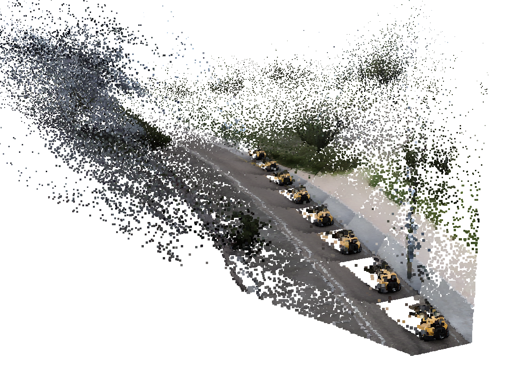
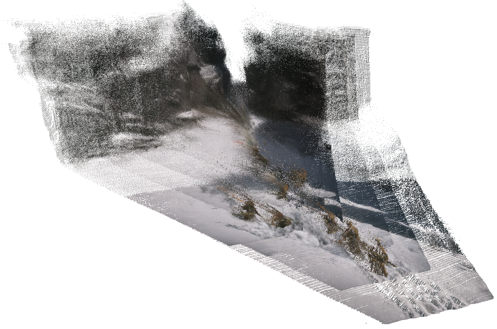

<p align="center">

<p>

# DeepVerse: 4D Autoregressive Video Generation as a World Model

<div align="center">

[](https://www.arxiv.org/abs/2506.01103)&nbsp;
[](https://sotamak1r.github.io/deepverse/)&nbsp;
[](https://huggingface.co/SOTAMak1r/DeepVerse/tree/main)&nbsp;

</div>


Can you imagine playing various different games through a single model? Like Black Myth: Wukong. 🤩
DeepVerse can "fantasize" the entire world behind images and enable free exploration through interaction 🎮️.
Please follow the instructions below to experience DeepVerse!

<!-- <p align="center">

<p> -->


## ✨️ News

* **2025-8:** The weight and code of DeepVerse are released! See [Here](https://huggingface.co/SOTAMak1r/DeepVerse/tree/main)!

* **2025-6:** The paper of DeepVerse is released! Also, check out our previous 4D diffusion world model [Aether](https://github.com/OpenRobotLab/Aether)!


## 🛠️ Installation

1. Set virtual environment 

    ```bash
    conda create -n deepverse python=3.10

    conda activate deepverse

    pip install torch==2.4.0 torchvision==0.19.0 --index-url https://download.pytorch.org/whl/cu121

    pip install -r requirements.txt
    ```

2. Model weight download

    ```python
    from huggingface_hub import snapshot_download

    repo_id  = "SOTAMak1r/DeepVerse1.1"
    ak = "your ak"

    snapshot_download(
        local_dir="/path/to/your/folder",
        repo_id=repo_id,
        local_dir_use_symlinks=False,
        resume_download=True,
        use_auth_token=ak,
    )
    ```

## 🚀 Inference

1. Let's start with a simple example. Use `--input_image` to specify the initial image, and `--model_path` as the directory for model weights.

    ```bash
    python run.py \
        --model_path  /path/to/model \
        --input_image  ./assets/demo1.png \
        --prompt_type text \
        --prompt 'The character rides a horse and walks on the street'
    ```
    
    
    The inference process runs on a single NVIDIA A800 with a speed of `4 FPS`, while the video is saved at `20 FPS`. The maximum GPU memory usage during inference is `17GB`. 
    All result files will be saved in the `output` folder by default.We present some sampling results. 

    <table style="text-align: center; margin-left: auto; margin-right: auto;">
    <tr>
    <td>
    <video controls width="100%" src="./assets/demo1.mp4" type="video/mp4">
    <video src="https://github.com/user-attachments/assets/9935da83-ae56-4672-8747-0f46e90f7b2b" autoplay muted loop playsinline></video>
    </td>
    <td>
    <video src="https://github.com/user-attachments/assets/0ae8d0f4-a00e-4391-8515-4c65261e3fad" autoplay muted loop playsinline></video>
    </td>
    </tr>

    <tr>
    <td>The character rides a horse and walks on the street</td>
    <td>The character walked along the snowy path</td>
    </tr>
    </table>
    
    To save depth images simultaneously, use `--add_depth`. To save point clouds simultaneously, use `--add_ply`. 
    When saving point clouds, we perform temporal sampling with a default interval of `8 frames`. 
    Additionally, we randomly downsample the point cloud to `1/10` of its original point count to further reduce the PLY file size. 
    If adjustments are needed, modify the configuration in the `save_ply` function in `run.py`.  
    Here’s an example command:

    ```bash
    python run.py \
        --model_path  /path/to/model \
        --input_image  ./assets/demo3.png \
        --prompt_type text \
        --prompt 'The car is driving slowly in the direction of the road'
        --add_depth  --add_ply
    
    The results will be saved as:

    output
    ├── generated_video.mp4          # rgb (+depth)
    ├── generated_video_frame0.ply   # frame 0's ply
    ├── generated_video_frame8.ply   # frame 8's ply
    ├── ...
    ├── generated_video_frame64.ply  # frame 64's ply
    ├── ...
    ```

    You will obtain the following results:

    <table style="text-align: center; margin-left: auto; margin-right: auto;">
    <tr>
    <td>
    <video src="https://github.com/user-attachments/assets/70104be3-e3ef-4adc-990b-14416d46214f" autoplay muted loop playsinline></video>
    </td>
    <td>
    
    </td>
    </tr>

    <tr>
    <td>RGB & Depth</td>
    <td>PLY files (visualized in <a href="https://www.meshlab.net/">Meshlab</a>)</td>
    </tr>
    </table>


2. DeepVerse supports control using actions, which are divided into two aspects: translation and steering, as detailed below:

    ```
    - translation：
       fL   F   fR
        \   |   /
          \ | /
      L ----+---- R
          / | \
        /   |   \
       rL   B   rR

    'S':  'Stay where you are.'
    'L':  'Move to the left.'
    'rL': 'Move to the rear left.'
    'B':  'Move backward.',
    'rR': 'Move to the rear right.'
    'R':  'Move to the right.'
    'fR': 'Move to the front right.'
    'F':  'Move forward.'
    'fL': 'Move to the front left.'

    - steering：
    'N': 'The perspective hasn\'t changed.',
    'L': 'Rotate the perspective counterclockwise.',
    'R': 'Rotate the perspective clockwise.',
    ```

    Each step must include both translation and steering signals. The translation signal comes first (which can be one or two characters), followed by the steering signal (a single character). The information for the same moment should be enclosed in `()`. Below is the format for inputting actions:  
    

    ```
    - 😄valid: (rLN)(fRL)(BN)(LN)(RN) ...

    - 😨invalid: (rL)(fR_L)(B)(N)(FRB) ...
    ```

    We provide an example command as follows, using `--prompt_type action` to specify the use of action control:

    ```
    python run.py \
        --model_path  /path/to/model \
        --input_image  ./assets/demo2.png \
        --prompt_type action \
        --prompt '(FN)(FN)(fLN)(fLN)(fRN)(fRN)(SN)(FR)(FR)(FR)(FN)(FN)(FN)' \
        --add_controler --add_depth --add_ply
    ```  

    Use the `--add_controler` command to include controller information in the saved video.  

    <table style="text-align: center; margin-left: auto; margin-right: auto;">
    <tr>
    <td>
    <video src="https://github.com/user-attachments/assets/89adff5b-7e43-40ad-9685-22ffff03af34" autoplay muted loop playsinline></video>
    </td>
    <td>
    
    </td>
    </tr>

    <tr>
    <td>(FN)(FN)(fLN)(fLN)(fRN)(fRN)(SN)(FR)(FR)(FR)(FN)(FN)(FN)</td>
    <td>PLY files</td>
    </tr>
    </table>


> **NOTE**: 
If you want to use action control on non-3A game images (OOD), we recommend using `--no_need_depth` for better visual results. This is because DeepVerse1.1's training set includes some real-world videos (without geometry labels) in the mix.

<table style="text-align: center; margin-left: auto; margin-right: auto;">
<tr>
<td>
<video src="https://github.com/user-attachments/assets/7934ca9a-c6f4-4d36-8b00-6683a191e291" autoplay muted loop playsinline></video>
</td>
<td>
<video src="https://github.com/user-attachments/assets/6116182c-487f-4650-a6ea-2d35bac4664c" autoplay muted loop playsinline></video>
</td>
</tr>

<tr>
<td>(BN)(BN)(BN)(BN)(BN)(BN)(SN)(SN)(BN)(BN)(BN)(BN)(BN)</td>
<td>(FN)(FN)(FN)(FN)(FN)(SN)(fRL)(fRL)(fRL)(fLR)(fLR)(fLR)(FN)(FN)(FN)</td>
</tr>
</table>


## 💌 Acknowledgment

We would like to express our gratitude to the contributors to the open-source community, as the following papers and code repositories form the foundation of our work:
(1) [Pyramid-Flow](https://github.com/jy0205/Pyramid-Flow?tab=readme-ov-file#finetuning-dit) and [SD3](https://github.com/Stability-AI/sd3.5): Provided open-source base models and code;
(2) [GameNGen](https://gamengen.github.io/): Offered valuable insights that significantly influenced our research direction;
(3) [Aether](https://aether-world.github.io/), [GST](https://github.com/SOTAMak1r/GST), and [Dust3R](https://github.com/naver/dust3r): Supplied open-source code and key functions.
These contributions have enriched our understanding and inspired our efforts.


## 🐳 Citation

If our work assists your research, feel free to give us a star ⭐ or cite us using:

```
@article{chen2025deepverse,
    title={DeepVerse: 4D Autoregressive Video Generation as a World Model},
    author={Chen, Junyi and Zhu, Haoyi and He, Xianglong and Wang, Yifan and Zhou, Jianjun and Chang, Wenzheng and Zhou, Yang and Li, Zizun and Fu, Zhoujie and Pang, Jiangmiao and others},
    journal={arXiv preprint arXiv:2506.01103},
    year={2025}
}
```
