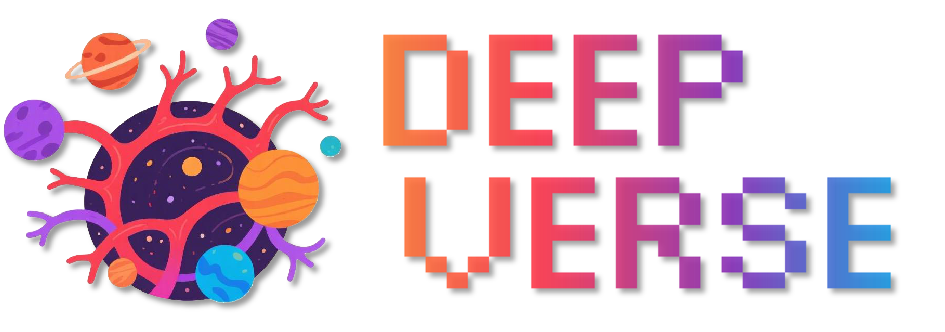

# DeepVerse: 4D Autoregressive Video Generation as a World Model

&nbsp;
&nbsp;

# ✨️ News

* **2025-6:** DeepVerse is released ! Also, check out our previous 4D diffusion world model [Aether](https://github.com/OpenRobotLab/Aether)!

